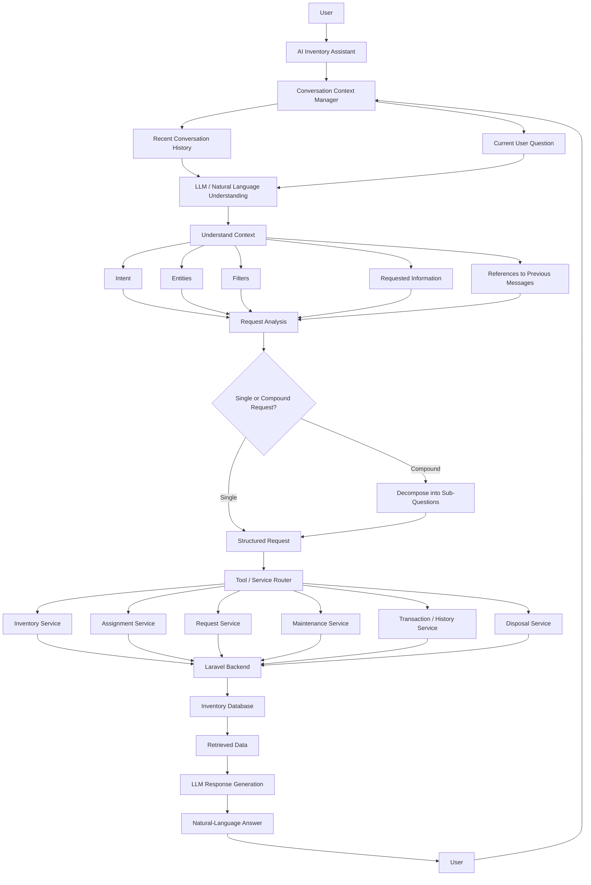

```mermaid
flowchart TD
    A["User"] --> B["AI Inventory Assistant"]

    B --> C["Conversation Context Manager"]

    C --> D["Recent Conversation History"]
    C --> E["Current User Question"]

    D --> F["LLM / Natural Language Understanding"]
    E --> F

    F --> G["Understand Context"]

    G --> G1["Intent"]
    G --> G2["Entities"]
    G --> G3["Filters"]
    G --> G4["Requested Information"]
    G --> G5["References to Previous Messages"]

    G1 --> H["Request Analysis"]
    G2 --> H
    G3 --> H
    G4 --> H
    G5 --> H

    H --> I{"Single or Compound Request?"}

    I -->|"Single"| J["Structured Request"]
    I -->|"Compound"| K["Decompose into Sub-Questions"]

    K --> J

    J --> L["Tool / Service Router"]

    L --> M1["Inventory Service"]
    L --> M2["Assignment Service"]
    L --> M3["Request Service"]
    L --> M4["Maintenance Service"]
    L --> M5["Transaction / History Service"]
    L --> M6["Disposal Service"]

    M1 --> N["Laravel Backend"]
    M2 --> N
    M3 --> N
    M4 --> N
    M5 --> N
    M6 --> N

    N --> O["Inventory Database"]

    O --> P["Retrieved Data"]

    P --> Q["LLM Response Generation"]

    Q --> R["Natural-Language Answer"]

    R --> S["User"]

    S --> C
```

url https://dnhs-inventory-management-system1.onrender.com

Then fill DB_*, APP_KEY, APP_URL (via Render dashboard env vars — never commit values).

